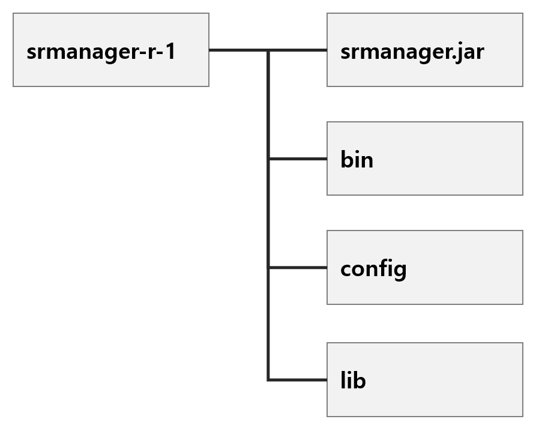
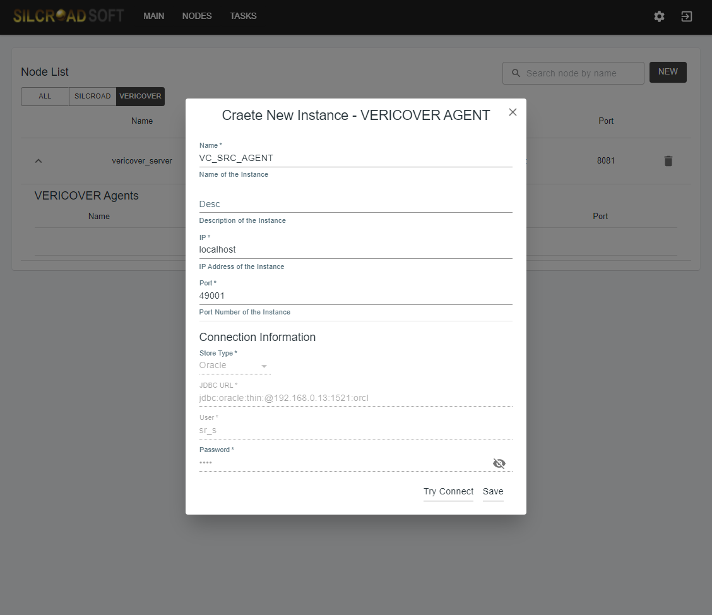
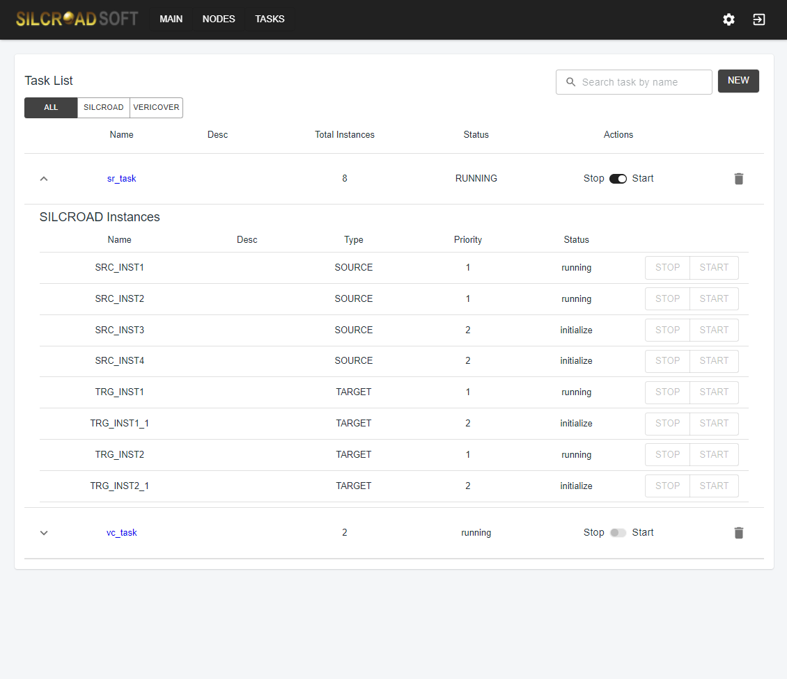

**SILCROAD Admin**

**설치 및 구동 가이드**

**SILCROAD Admin v2.0**

**\
**

**Copyright Notice**

Copyright ⓒ 2016 SILCROAD Soft Co., Ltd. All Rights Reserved.

대한민국 경기도 수원시 영통구 광교로 105

경기 R&DB센터707호 우) 16229

Tel) 031-888-5698 Fax) 031-888-5699

**안내서 정보**

안내서 제목: SILCROAD Admin 설치 및 구동 가이드

소프트웨어 버전: SILCROAD Admin v2.0

# 목차 {#목차 .list-paragraph}

[목차 [3](#_Toc90310346)](#_Toc90310346)

[1. Admin 개요 [5](#admin-개요)](#admin-개요)

[1.1. 프로세스 구성 [6](#프로세스-구성)](#프로세스-구성)

[2. SILCROAD Manager 환경 제약 사항
[7](#silcroad-manager-환경-제약-사항)](#silcroad-manager-환경-제약-사항)

[2.1. 지원 플랫폼 및 운영체제
[7](#지원-플랫폼-및-운영체제)](#지원-플랫폼-및-운영체제)

[2.2. 설치 요구 및 권장 사항
[7](#설치-요구-및-권장-사항)](#설치-요구-및-권장-사항)

[3. SILCROAD Manager 설치
[8](#silcroad-manager-설치)](#silcroad-manager-설치)

[3.1. 압축해제 및 디렉토리 구성
[8](#압축해제-및-디렉토리-구성)](#압축해제-및-디렉토리-구성)

[4. SILCROAD Manager 설정 및 실행
[9](#silcroad-manager-설정-및-실행)](#silcroad-manager-설정-및-실행)

[4.1. 설정 [9](#설정)](#설정)

[4.2. 실행 및 종료 [13](#실행-및-종료)](#실행-및-종료)

[5. SILCROAD Admin 서버 환경 제약 사항
[14](#silcroad-admin-서버-환경-제약-사항)](#silcroad-admin-서버-환경-제약-사항)

[5.1. 지원 플랫폼 및 운영체제
[14](#지원-플랫폼-및-운영체제-1)](#지원-플랫폼-및-운영체제-1)

[5.2. 설치 요구 및 권장 사항
[14](#설치-요구-및-권장-사항-1)](#설치-요구-및-권장-사항-1)

[6. SILCROAD Admin서버 설치
[15](#silcroad-admin서버-설치)](#silcroad-admin서버-설치)

[7. SILCROAD Admin 서버 설정 및 실행
[16](#silcroad-admin-서버-설정-및-실행)](#silcroad-admin-서버-설정-및-실행)

[7.1. 설정 [16](#설정-1)](#설정-1)

[7.2. 실행 및 종료 [18](#실행-및-종료-1)](#실행-및-종료-1)

[8. SILCROAD Admin 서버 사용
[19](#silcroad-admin-서버-사용)](#silcroad-admin-서버-사용)

[8.1. 대시보드(Dashboard) [20](#대시보드dashboard)](#대시보드dashboard)

[8.2. 노드(Node) 관리 [24](#노드node-관리)](#노드node-관리)

[8.3. 태스크(Task) 관리 [30](#태스크task-관리)](#태스크task-관리)

[8.4. SILCROAD RealRep 태스크
[37](#silcroad-realrep-태스크)](#silcroad-realrep-태스크)

[8.5. SILCROAD Vericover 태스크
[49](#silcroad-vericover-태스크)](#silcroad-vericover-태스크)

[9. 운영 사항 [64](#운영-사항)](#운영-사항)

[9.1. SSL 인증서 변경 및 설정
[64](#ssl-인증서-등록-및-설정)](#ssl-인증서-등록-및-설정)

[9.2. Read Only 계정 생성
[66](#read-only-계정-생성)](#read-only-계정-생성)

[9.3. 디스크(Disk) 용량 관리
[67](#디스크disk-용량-관리)](#디스크disk-용량-관리)

[9.4. SILCROAD Manager의 JDBC Driver 등록
[67](#silcroad-manager의-jdbc-driver-등록)](#silcroad-manager의-jdbc-driver-등록)

[9.5. SILCROAD Manager, Vericover 방화벽 설정
[68](#silcroad-manager-vericover-방화벽-설정)](#silcroad-manager-vericover-방화벽-설정)

[9.6. Admin 서버에 Node/Instance 등록 실패 시 대처 방법
[69](#admin-서버에-nodeinstance-등록-실패-시-대처-방법)](#admin-서버에-nodeinstance-등록-실패-시-대처-방법)

[9.7. SILCROAD RealRep 실행 실패 시 대처 방법
[72](#silcroad-realrep-실행-실패-시-대처-방법)](#silcroad-realrep-실행-실패-시-대처-방법)

[9.8. SILCROAD RealRep의 Failover 기능 자동 실행
[73](#silcroad-realrep의-failover-기능-자동-실행)](#silcroad-realrep의-failover-기능-자동-실행)

[10. 부록 [74](#부록)](#부록)

[10.1. SILCROAD RealRep Failover 기능
[74](#silcroad-realrep-failover-기능)](#silcroad-realrep-failover-기능)

# Admin 개요

SILCROAD Admin은 SILCROAD RealRep 및 Vericover를 모니터링하기 위해
제공되는 프로그램이다. SILCROAD의 CDC 구조는 동기화 작업을 하는 SILCROAD
RealRep과 그에 대한 제어/통계 수집을 위한 SILCROAD Manager로 이루어져
있고, 정합성 검증 구조는 검증 작업을 하는 Vericover Agent와 그에 대한
제어/통계 수집을 위한 Vericover Server로 이루어져 있다. 마지막으로
사용자에게 GUI(Graphic User Interface)를 제공하는 SILCROAD Admin 서버로
구성된다.

{width="6.268055555555556in"
height="2.966666666666667in"}

\[그림 1‑1\] SILCROAD ADMIN

## 프로세스 구성

### SILCROAD Manager

SILCROAD Manager는 SILCROAD RealRep과 SILCROAD Admin을 연결하는 역할을
수행하며, 아래와 같은 기능을 포함한다.

-   SILCROAD RealRep 제어 및 통계 수집

-   시스템 자원 사용량 수집

-   시스템 자원 사용량에 따른 SILCROAD RealRep pause/resume

### SILCROAD Admin 서버

SILCROAD Admin 서버는 Web 기반의 GUI를 제공하여 사용자가 SILCROAD
RealRep의 제어와 시스템 자원 사용량 및 SILCROAD의 동기화 상황을 모니터링
할 수 있도록 한다. SILCROAD Admin 서버가 제공하는 기능은 아래와 같다.

-   동기화 Topology 관리 기능

-   SILCROAD RealRep 관리 및 제어 기능

-   시스템 및 SILCROAD RealRep 동기화 통계 차트 제공

-   VERICOVER 수행 및 결과 확인 기능

# SILCROAD Manager 환경 제약 사항

본 절에서는 SILCROAD Manager 설치 전 필요한 환경에 대해 확인한다.
SILCROAD Manager 설치 전 확인해야 할 사항은 다음과 같다.

-   지원 OS 및 H/W

-   시스템 환경 확인

-   SILCROAD Manager 설치 시 요구 및 권장 사항

## 지원 플랫폼 및 운영체제

SILCROAD Manager가 지원하는 운영체제는 UNIX 계열 및 Windows 계열이다.
세부 사항은 각 항목을 참조한다.

+------------+-------------------+-----------------------+------------+
| H/W, S/W   | CPU               | OS                    | Binary     |
|            |                   |                       | Bits       |
+============+===================+=======================+============+
| HP         | Itanium           | HP-UX 11i v2 (11.23)  | 64bits     |
|            |                   |                       |            |
|            |                   | HP-UX 11i v3 (11.31)  |            |
+------------+-------------------+-----------------------+------------+
| IBM        | PPC               | AIX 6.1               | 64bits     |
|            |                   |                       |            |
|            |                   | AIX 7.1               |            |
+------------+-------------------+-----------------------+------------+
| GNU        | X86 (Pentium4     | Red Hat Enterprise    | 64bits     |
|            | 이상)             | Linux 4               |            |
|            |                   |                       |            |
|            |                   | Red Hat Enterprise    |            |
|            |                   | Linux 5               |            |
|            |                   |                       |            |
|            |                   | Red Hat Enterprise    |            |
|            |                   | Linux 6               |            |
|            |                   |                       |            |
|            |                   | Red Hat Enterprise    |            |
|            |                   | Linux 7               |            |
|            |                   |                       |            |
|            |                   | SUSE Linux Enterprise |            |
|            |                   | Server 10             |            |
+------------+-------------------+-----------------------+------------+
| SOLARIS    | Sparc9            | SunOS 5.9             | 64bit      |
+------------+-------------------+-----------------------+------------+
| WINDOW     | X86 (Pentium4     | Windows 2003          | 64bit      |
|            | 이상)             | enterprise SP2 이상   |            |
+------------+-------------------+-----------------------+------------+

\[표 2‑1\] 지원 플랫폼 및 운영체제

## 설치 요구 및 권장 사항

SILCROAD Manager는 JRE 1.8 이상이 설치되어 있어야 한다.

SILCROAD Manager는 512M 이상의 메모리 여유 공간이 필요하다.

SILCROAD Manager는 Admin 서버 연동을 위한 Port를 LISTEN하며, 해당 Port는
Admin 서버가 설치된 장비에서 접속이 가능해야 한다

# SILCROAD Manager 설치

## 압축해제 및 디렉토리 구성

SILCROAD Manager는 별도의 압축파일을 해제하는 것으로 간단하게 설치할 수
있다.

  -----------------------------------------------------------------------
  \# tar xzvf srmanager-r-xxx.tar.gz
  -----------------------------------------------------------------------

  -----------------------------------------------------------------------

압축 해제를 완료하면, 아래와 같은 디렉토리 구조를 볼 수 있다.

{width="3.810126859142607in"
height="3.0635575240594926in"}

-   srmanager.jar: binary jar 파일

-   config: 설정 파일을 포함하는 폴더

-   bin: 구동 스크립트 파일을 포함하는 폴더

-   lib: 구동에 필요한 라이브러리를 포함하는 폴더

# SILCROAD Manager 설정 및 실행

본 장에서는 3장에서 설치한 SILCROAD Manager에 대해 설정파일 수정 및
기동방법에 대해 알아본다.

## 설정

SILCROAD Manager를 구동하기 위해서는 Manager의 설정
파일(config/srmanager.properties)를 수정하여야 하며, 각 설정 별 의미는
아래와 같다.

### 기본 설정

  -----------------------------------------------------------------------------------------------------------------------------
  항목 명                                  설명                                      유형      단위        범위       기본 값
  ---------------------------------------- ----------------------------------------- --------- ----------- ---------- ---------
  listen.ip                                Manager가 listen 하는 IP 주소와 포트      문자열    \-          0\~255.    0.0.0.0
                                           번호. Admin 서버에서 접속할 수 있도록                           0\~255.    
                                           방화벽 우회 확인 필수.                                          0\~255.    
                                                                                                           0\~255     

  listen.port                                                                        숫자      \-          0\~65535   49009

  db.jdbc.path                             Database의 JDBC 드라이버 라이브러리의     문자열\   \-          \-         \-
                                           절대 경로로 여러 개 입력시 :으로          (절대                            
                                           구분한다.                                 경로)                            

  statistics.retention.hours               Manager 내부에 축적되는 통계 데이터의     숫자      hr          0\~240     2
                                           유지 시간, 설정 값이 2라면 2시간 이상된                                    
                                           통계 데이터를 삭제한다                                                     

  resource.collect.period.second           시스템 자원 측정 주기                     숫자      sec         5 \~ 60    5

  resource.sysCpu.period.second            System cpu 사용량이 특정 값 이상으로 일정 숫자      sec         5 \~ 60    30
                                           시간 유지되면 RealRep을 종료시킴. (종료                                    
                                           조건 중 관측 시간에 해당하는 설정)                                         

  resource.sysCpu.stopThreshold.percent    System cpu 사용량이 해당 설정 값 이상으로 숫자      백분율(%)   0 \~ 100   0
                                           일정 시간 유지되면 RealRep을 종료시킴                                      
                                           (종료 조건의 사용량에 해당하는 설정)\                                      
                                           \                                                                          
                                           예시 : resource.sysCpu.period.second이                                     
                                           30이고                                                                     
                                           resource.sysCpu.stopThreshold.percent이                                    
                                           70이라면 30초간 System cpu 평균 사용량이                                   
                                           70% 이상이면 RealRep 종료\                                                 
                                           \                                                                          
                                           참고 : 값이 0으로 설정되면 System cpu                                      
                                           사용량에 따른 종료를 기능을 사용하지                                       
                                           않는다                                                                     

  resource.sysCpu.startThreshold.percent   System cpu 사용량 과다로 RealRep이 종료된 숫자      백분율(%)   0 \~ 100   0
                                           이후 일정 시간 동안 System cpu 사용량                                      
                                           평균 값이 낮으면 Realrep을 재실행 한다\                                    
                                           \                                                                          
                                           참고 : 값이 0으로 설정되면 재실행을                                        
                                           수행하지 않는다                                                            

  resource.procCpu.period.second           System cpu 사용량 대신 RealRep의 cpu      숫자      sec         5 \~ 60    30
                                           사용량을 종료 조건으로 사용하는 설정                                       
                                           (종료 조건의 관측 시간에 해당하는 설정)\                                   
                                           \                                                                          
                                           참고 : 값이 0으로 설정되면 종료 기능을                                     
                                           수행하지 않는다                                                            

  resource.procCpu.stopThreshold.percent   System cpu 사용량 대신 RealRep의 cpu      숫자      백분율(%)   0 \~ 100   0
                                           사용량을 종료 조건으로 사용하는 설정                                       
                                           (종료 조건의 사용량에 해당하는 설정)\                                      
                                           \                                                                          
                                           주의 : 해당 설정으로 종료될 때는 resume                                    
                                           기능 지원하지 않음\                                                        
                                           \                                                                          
                                           참고 : 값이 0으로 설정되면 종료 기능을                                     
                                           수행하지 않는다                                                            

  resource.sysMem.period.second            System cpu 사용량 대신 System memory      숫자      sec         5 \~ 60    30
                                           사용량을 종료 조건으로 사용하는 설정                                       
                                           (종료 조건의 관측 시간에 해당하는 설정)                                    

  resource.sysMem.stopThreshold.percent    System cpu 사용량 대신 System memory      숫자      백분율(%)   0 \~ 100   0
                                           사용량을 종료 조건으로 사용하는 설정                                       
                                           (종료 조건의 사용량에 해당하는 설정)\                                      
                                           \                                                                          
                                           참고 : 값이 0으로 설정되면 종료 기능을                                     
                                           수행하지 않는다                                                            

  resource.sysMem.startThreshold.percent   System memory 사용량 과다로 RealRep이     숫자      백분율(%)   0 \~ 100   0
                                           종료된 이후 일정 시간 동안 System memory                                   
                                           사용량 평균 값이 낮으면 Realrep을 재실행                                   
                                           한다\                                                                      
                                           \                                                                          
                                           참고 : 값이 0으로 설정되면 재실행 기능을                                   
                                           수행하지 않는다\                                                           
                                           \                                                                          
                                           주의 : System cpu, System memory에 의한                                    
                                           종료 조건이 둘 다 설정 되었다면 재실행                                     
                                           조건도 둘다 만족해야 재실행 가능                                           

  resource.procMem.period.second           System cpu 사용량 대신 RealRep memory     숫자      sec         5 \~ 60    30
                                           사용량을 종료 조건으로 사용하는 설정                                       
                                           (종료 조건의 관측 시간에 해당하는 설정)                                    

  resource.procMem.stopThreshold.percent   System cpu 사용량 대신 RealRep memory     숫자      백분율(%)   0 \~ 100   0
                                           사용량을 종료 조건으로 사용하는 설정                                       
                                           (종료 조건의 사용량에 해당하는 설정)                                       
  -----------------------------------------------------------------------------------------------------------------------------

\[표 4‑1\] SILCROAD Manager 기본 설정

### 상세 설정 (설치 시 설정된 값 유지 권장)

  ------------------------------------------------------------------------------------------
  항목 명                         설명                       유형     단위   범위    기본 값
  ------------------------------- -------------------------- -------- ------ ------- -------
  Manager.id                      Manager 내부 기능을 위한   문자열   \-     \-      sm1
                                  id 값\                                             
                                  \                                                  
                                  참고 : sm + 숫자 값으로                            
                                  구성해야 함                                        

  srconf.rolling.max              RealRep 실행 시 마다       숫자     \-     1 \~ 10 3
                                  이전에 사용하였던 설정을                           
                                  백업하는 기능. 설정 값만큼                         
                                  백업 파일 존재 가능                                

  json.rolling.max                RealRep 실행 시 마다       숫자     \-     1 \~ 10 3
                                  이전에 사용한 mapping                              
                                  table 설정을 백업하는                              
                                  기능. 설정 값만큼 백업                             
                                  파일 존재 가능                                     

  process.start.timeout.seconds   Manager 내부 기능을 위한   숫자     sec    10 \~   10
                                  설정 값\                                   20      
                                  \                                                  
                                  주의 : 수정 하지 않는 것을                         
                                  권장                                               

  process.stop.timeout.seconds                               숫자     sec    10 \~   10
                                                                             20      

  wait.onProcessComplete.second                              숫자     sec    5 \~ 10 5

  shutdown.retention.seconds                                 숫자     sec    30 \~   30
                                                                             600     

  logpump.enable                  RealRep 보조 process 사용  선택     \-     true,   false
                                  유무와 RealRep 보조                        false   
                                  process directory 위치\                            
                                  \                                                  
                                  주의 : 수정 하지 않는 것을                         
                                  권장                                               

  logpump.instance.home                                      선택     \-     \-      \-
  ------------------------------------------------------------------------------------------

\[표 4‑2\] SILCROAD Manager 고급 설정

### 설정 예제

srmanager.properties의 예제는 아래와 같다.

+-----------------------------------------------------------------------+
| \# 일반 설정                                                          |
|                                                                       |
| listen.ip=0.0.0.0                                                     |
|                                                                       |
| listen.port=49009                                                     |
|                                                                       |
| \# db.jdbc.path 예시(oracle, tibero 사용) :                           |
| db.jdbc.path=/home/sr/lib/odbc6.jar:/home/sr/lib/tibero6-jdbc.jar     |
|                                                                       |
| db.jdbc.path=""                                                       |
|                                                                       |
| statistics.retention.hours=2                                          |
|                                                                       |
| resource.collect.period.second=30                                     |
|                                                                       |
| resource.sysCpu.period.second=30                                      |
|                                                                       |
| resource.sysCpu.stopThreshold.percent=0                               |
|                                                                       |
| resource.sysCpu.startThreshold.percent=0                              |
|                                                                       |
| resource.procCpu.period.second=30                                     |
|                                                                       |
| resource.procCpu.stopThreshold.percent=0                              |
|                                                                       |
| resource.sysMem.period.second=30                                      |
|                                                                       |
| resource.sysMem.stopThreshold.percent=0                               |
|                                                                       |
| resource.sysMem.startThreshold.percent=0                              |
|                                                                       |
| resource.procMem.period.second=30                                     |
|                                                                       |
| resource.procMem.stopThreshold.percent=0                              |
|                                                                       |
| \# 상세 설정                                                          |
|                                                                       |
| manager.id=sm1                                                        |
|                                                                       |
| srconf.rolling.max=3                                                  |
|                                                                       |
| json.rolling.max=3                                                    |
|                                                                       |
| process.start.timeout.seconds=10                                      |
|                                                                       |
| process.stop.timeout.seconds=10                                       |
|                                                                       |
| wait.onProcessComplete.second=5                                       |
|                                                                       |
| shutdown.retention.seconds=30                                         |
|                                                                       |
| logpump.enable=false                                                  |
|                                                                       |
| logpump.instance.home=""                                              |
+=======================================================================+
+-----------------------------------------------------------------------+

\[표 4‑3\] agent.properties 예제

## 실행 및 종료

SILCROAD Manager 실행을 위해서는 다음과 같은 작업이 완료되었음을
가정한다.

-   SILCROAD Manager 설치 완료 (3. SILCROAD Manager 설치 참고)

-   SILCROAD Manager 설정 완료 \[[4.1. SILCROAD Manager 설정](#설정)
    참고\]

cd srmanager-r-1/bin (srmanager 설치 디렉토리의 bin 폴더)로 이동하여
아래와 같이 cmd를 사용하여 프로그램을 실행할 수 있다.

  -----------------------------------------------------------------------
  \# sh srmanager_start.sh
  -----------------------------------------------------------------------

  -----------------------------------------------------------------------

cd srmanager-r-1/bin (srmanager 설치 디렉토리의 bin 폴더)로 이동하여
아래와 같이 cmd를 사용하여 프로그램을 중지할 수 있다.

  -----------------------------------------------------------------------
  \# sh srmanager_stop.sh
  -----------------------------------------------------------------------

  -----------------------------------------------------------------------

-   

# SILCROAD Admin 서버 환경 제약 사항

## 지원 플랫폼 및 운영체제

SILCROAD Admin 서버는 JRE 1.8 이상이 설치된 모든 운영체제에서 사용이
가능하다.

## 설치 요구 및 권장 사항

SILCROAD Admin 서버를 통해 Replication 작업을 수행하기 위해서는
소스/타겟 서버에 설치된 SILCROAD Manager와의 연동이 필요하며, 각 서버의
Listen port로 접속이 가능해야 한다.

SILCROAD Admin 서버를 통해 Comparison 작업을 수행하기 위해서는 VERICOVER
Server와의 연동이 필요하며, 해당 서버의 Listen port로 접속이 가능해야
한다.

구동과 관련된 커맨드가 shell script로 작성되었기 때문에 UNIX 계열의
서버에서 구동하는 것을 권장한다.

# SILCROAD Admin서버 설치

SILCROAD Admin 서버는 압축파일을 해제하는 것으로 간단하게 설치할 수
있으며, 별도의 추가 설치 과정은 필요하지 않다.

  -----------------------------------------------------------------------
  \# tar -zxvf webadm-1.0-r-1.tar.gz
  -----------------------------------------------------------------------

  -----------------------------------------------------------------------

압축 해제를 완료하면, 아래와 같은 디렉토리 구조를 볼 수 있다.

{width="4.0in"
height="2.3273851706036743in"}

-   bin: 구동과 관련된 스크립트 폴더

-   boot: 실행 파일인 webadm-1.0.jar가 위치한 폴더

-   config: 구동에 필요한 설정 폴더

# SILCROAD Admin 서버 설정 및 실행

본 장에서는 6장에서 설치한 SILCROAD Admin 서버의 설정 파일 수정 및 기동
방법에 대해 알아본다.

## 설정

SILCROAD Admin 서버를 구동하기 위해서는 Application의 설정
파일(config/application.propertie s)를 수정하여야 하며, 각 설정 별
의미는 아래와 같다.

  ------------------------------------------------------------------------------------------------------------------------------------------------
  항목 명                                     설명                   유형     단위   범위            기본값
  ------------------------------------------- ---------------------- -------- ------ --------------- ---------------------------------------------
  spring.jpa.open-in-view                     OSIV (Open Session in  선택     \-     true, false     true
                                              View) 설정 여부                                        

  spring.datasource.url                       DB의 jdbc URL 주소     문자열   \-     \-              jdbc:h2:file:./data/admsvr;CACHE_SIZE=32768

  spring.datasource.driverClassName           DB의 Jdbc driver       문자열   \-     \-              org.h2.Driver

  spring.datasource.username                  DB의 계정 이름         문자열   \-     \-              silcroad

  spring.datasource.password                  DB의 계정 비밀번호     문자열   \-     \-              silcroad

  spring.jpa.hibernate.ddl-auto               데이터베이스 초기화    문자열   \-     none,           update
                                              전략 설정                              create-drop,    
                                                                                     create, update, 
                                                                                     validate        

  spring.jwt.secret                           JWT의 비밀키 설정      문자열   \-     \-              sr_web_server!@\#

  webadm.internetwork.connect.timeout.ms      외부 시스템(Manager,   숫자     ms     5000\~3000000   20000
                                              Vericover)의 연결                                      
                                              타임아웃                                               

  webadm.internetwork.socket.timeout.ms       외부 시스템의 단절     숫자     ms     5000\~3000000   60000
                                              판단 시간                                              

  webadm.internetwork.request.timeout.ms      외부 시스템에 요청 후  숫자     ms     5000\~3000000   30000
                                              최대 대기 시간                                         

  webadm.internetwork.heartbeat.interval.ms   외부 시스템에          숫자     ms     1000\~100000    10000
                                              Heartbeat 메시지 전송                                  
                                              주기                                                   

  webadm.job_manager.parallel.size            비동기 작업(매핑       숫자     \-     1\~16           4
                                              테이블 수정 작업에                                     
                                              의한 적용)에 대한 최대                                 
                                              스레드 개수                                            

  webadm.meta_worker.parallel.size            테이블 매핑 수행을     숫자     \-     1\~16           4
                                              위한 스레드의 개수                                     

  webadm.history.retention.hours              사용 기록(History)     숫자     hr     24\~8760        168
                                              보관 주기                                              

  webadm.metric.retention.hours               통계 보관 주기         숫자     hr     24\~8760        48

  webadm.metric.collection.interval.ms        Manager에게 통계를     숫자     ms     1000\~3000000   5000
                                              요청하는 주기                                          

  webadm.cluster.disconnect.determine.ms      해당 설정의 1.5배의    숫자     ms     5000\~3000000   60000
                                              시간 동안 연결이 안될                                  
                                              경우 Disable로                                         
                                              판단하여 Failover를                                    
                                              수행함                                                 

  webadm.rest.auth.accesstoken.maxage         View 권한을 주는       숫자     sec    600\~604800     604800
                                              access token의 만료                                    
                                              기간                                                   

  webadm.rest.auth.admintoken.maxage          Post 권한을 주는 admin 숫자     sec    600\~604800     86400
                                              token의 만료 기간                                      

  server.port                                 서버를 실행할 포트     숫자     \-     1\~65536        8080

  logging.config                              서버의 로그 레벨 및    문자열   \-     \-              config/logback-spring.xml
                                              파일 설정                                              

  server.ssl.key-store-type                   SSL을 위한 key store   문자열   \-     PKCS12, JKS     PKCS12
                                              형식                                                   

  server.ssl.key-store                        인증서가 포함된 key    문자열   \-     \-              classpath:dev.localhost.com.p12
                                              store 파일 위치                                        

  server.ssl.key-store-password               인증서 생성에 사용한   문자열   \-     \-              qwe123
                                              비밀번호                                               

  server.ssl.enabled                          HTTPS 요청만           선택     \-     true, false     true
                                              수락하도록 Spring                                      
                                              Security 활성화 여부                                   
  ------------------------------------------------------------------------------------------------------------------------------------------------

\[표 7‑1\] application.properties 각 설정 별 의미

## 실행 및 종료

SILCROAD Admin 서버를 구동하기 위해서는 "[6. SILCROAD Admin
설치](#silcroad-admin서버-설치)"에서 압축 해제한 bin 폴더로 이동하여
아래의 명령어를 통해 실행 가능하다.

UNIX 계열의 호스트에서는 아래와 같이 cmd를 사용하여 프로그램을 실행할 수
있다.

  -----------------------------------------------------------------------
  \# sh webadm_start.sh
  -----------------------------------------------------------------------

  -----------------------------------------------------------------------

프로그램을 종료해야 한다면 아래와 같이 cmd를 사용하여 프로그램을 중지할
수 있다.

  -----------------------------------------------------------------------
  \# sh webadm_stop.sh
  -----------------------------------------------------------------------

  -----------------------------------------------------------------------

# SILCROAD Admin 서버 사용

SILCROAD Admin 서버를 실행하면, 아래의 그림에서 보이는 것과 같은 로그인
화면을 볼 수 있다. 접속을 위한 정보는 아래와 같다.

  -----------------------------------------------------------------------
  **ID**                              **PASSWORD**
  ----------------------------------- -----------------------------------
  admin                               admin

  -----------------------------------------------------------------------

\[표 8‑1\] Admin 초기 아이디 및 비밀번호

{width="6.267361111111111in"
height="5.395138888888889in"}

\[그림 8‑1\] SILCROAD Admin 로그인 화면

사용자는 Admin 화면을 통해 Task의 등록 및 삭제 동작을 진행할 수 있으며,
SILCROAD와 VERICOVER의 연동을 통해 데이터 동기화 및 데이터 정합성 검증을
진행할 수 있다.

## 대시보드(Dashboard)

{width="6.2555555555555555in"
height="5.372222222222222in"}

\[그림 8‑2\] SILCROAD Admin Main 화면

위 그림은 SILCROAD Admin의 로그인 후, 볼 수 있는 메인 화면이다. 메인
화면은 크게 "주요 기능 메뉴"과 "Overview 화면"으로 나누어진다.

### 주요 기능 메뉴

{width="6.265080927384077in"
height="0.7441863517060368in"}

\[그림 8‑3\] SILCROAD Admin 주요 기능 메뉴

-   MAIN: 생성한 Task들의 요약 정보를 포함하는 메인 Dashboard 화면을
    보여준다.

-   NODES: Node (SILCROAD Manager, Vericover Server)와 Instance
    (RealRep, Vericover Agent)의 생성과 관리 화면을 보여준다.

-   {width="0.20833333333333334in"
    height="0.19583333333333333in"}TASKS: Task (Replication, Comparison)
    생성과 관리 화면을 보여준다.

-   Setting icon ( ): 사용자 등록 기능을 수행하는 "User Register" 버튼을
    보여준다 \[그림 8-4 참조\].

-   {width="0.26666666666666666in"
    height="0.2548611111111111in"}Logout icon ( ): 접속한 사용자가
    접속을 해제할 수 있는 기능을 제공한다.

{width="6.2555555555555555in"
height="5.395138888888889in"}

\[그림 8‑4\] SILCROAD Admin 사용자 등록 화면

### SILCROAD RealRep 요약

{width="6.255813648293963in"
height="1.6965277777777779in"}

\[그림 8‑5\] SILCROAD Admin RealRep 요약

-   Sync Delay (Seconds): source database에서 target database로의 동기화
    지연 시간을 보여준다.

-   Throughput (DML/s): 초당 DML 동기화 작업 처리량을 보여준다.

-   Status: Replication의 Status의 각 출력 항목은 아래와 같다.

    -   INITIALIZING: Task가 생성된 후 admin server와 해당 task에 연결된
        SILCROAD Manager 서버 사이의 연결 대기 중인 상태를 의미한다.
        대기 시간은 사용자가 config에서 설정한
        시간(webadm.cluster.disconnect.determine.ms)만큼 진행된다.

    -   UNSTABLE: Admin과 해당 task에 속한 SILCROAD Manager 사이의
        연결이 불안정한 상태를 의미한다.

    -   READY: 해당 Task가 시작할 수 있는 상태를 의미한다.

    -   STOPPING: 해당 Task가 멈추는 작업을 진행 중인 상태를 의미한다.

    -   STARTING: 해당 Task가 시작하는 작업을 진행 중인 상태를 의미한다.

    -   RUNNING: 해당 Task가 동기화 작업을 정상적으로 진행 중인 상태를
        의미한다.

    -   ABORTED: 해당 Task가 동기화 진행 중 문제 상황으로 종료된 상태를
        의미한다.

-   Source/Target Objects: 동기화를 위해 연결한 source와 target의
    테이블의 수를 보여준다.

-   Source SCN: 가장 최근 진행된 Source database의 트랜잭션 번호를
    보여준다.

-   Target SCN: 가장 최근 진행된 Target database의 트랜잭션 번호를
    보여준다.

-   VIEW ALL button: 해당 Task의 상세 정보를 볼 수 있는 화면을 보여준다.

### SILCROAD Vericover 요약

{width="6.254997812773404in"
height="1.3717377515310587in"}

\[그림 8‑6\] SILCROAD Admin Vericover 요약

-   Status: Comparison의 Status의 각 출력 항목은 아래와 같다.

    -   INITIALIZED: Task 생성 후 진행된 작업이 없는 상태를 의미한다.

    -   RUNNING: 해당 Task가 데이터 검증 작업을 정상적으로 진행 중인
        상태를 의미한다.

    -   WAITING: 해당 Task가 실행을 대기하고 있는 상태를 의미한다.

    -   INTERRUPTED_BY_EXTERNAL: 사용자가 stop을 눌러 작업을 멈춘 상태를
        의미한다.

    -   STOPPED_BY_ERROR: 진행 중인 작업이 내부적인 문제 상황을 종료된
        상태를 의미한다.

-   Latest Start Time: 최근의 작업 시작 시간을 보여준다.

-   Latest Runtime: 최근 작업의 실행 시간을 보여준다.

-   Bar Chart: 데이터 검증 테이블 중 일치, 불일치, 에러 상태인 테이블의
    수를 보여준다.

-   Total: 데이터 검증 대상 테이블의 수(Total)를 보여준다.

-   Completed: 데이터 검증이 완료된 테이블의 수를 보여준다.

-   Running: 데이터 검증 작업이 진행되고 있는 테이블의 수를 보여준다.

-   Error: 데이터 검증 작업 중 Error가 발생한 테이블의 수를 보여준다.

## 노드(Node) 관리

{width="6.267361111111111in"
height="5.395138888888889in"}

\[그림 8‑7\] SILCROAD Admin Nodes 화면

메뉴에서 "NODES" 버튼을 클릭 시, Node 관리 화면이 출력되며 해당 화면은
크게 "Node List"와 "Node 생성 및 삭제"로 나누어진다.

{width="6.257596237970254in"
height="0.8953488626421697in"}

\[그림 8‑8\] SILCROAD Admin Node List의 기능

Node List 화면의 구성은 아래와 같다.

-   Search Field: Node의 이름을 기반으로 검색할 수 있는 기능을 제공한다.

-   NEW 버튼: Node를 생성하기 위한 화면의 출력한다 \[그림 8-9 참조\].

-   ALL \| SILCROAD \| VERICOVER 버튼: Node List를 타입별로
    filtering하는 기능을 제공한다.

-   Table: 생성된 Node의 이름과 설명, 유형, IP, Port 정보를 보여준다.

### 노드 추가 (SILCROAD Manager, Vericover Server)

노드의 추가 작업은 NODES 화면에서 NEW 버튼을 눌러 실행한다. 노드의
종류는 SILCROAD Manager와 Vericover Server가 있으며, 노드 등록 시
사용자의 선택에 따라 해당 노드의 타입이 정해진다.

{width="6.267361111111111in"
height="5.395138888888889in"}

\[그림 8‑9\] SILCROAD Admin Node 등록 화면

SILCROAD Manager 또는 Vericover Server Node 등록 화면의 구성은 아래와
같다.

-   SILCROAD \| VERICOVER SERVER: 노드의 타입을 선택한다.

-   Name (required): 노드를 대표할 이름을 입력한다.

-   Desc (optional): 노드에 대한 설명을 입력한다.

-   IP (required): 노드가 설치된 서버의 IP 주소를 입력한다.

-   Port (required): 설치한 노드 설정 파일에서 설정한 port 정보를
    입력한다.

### 인스턴스 추가 (SILCROAD RealRep, Vericover Agent)

{width="0.18611111111111112in"
height="0.19791666666666666in"}{width="0.25555555555555554in"
height="0.24444444444444444in"}노드에서 관리하는 인스턴스는 해당 노드의
화살표 아이콘( )을 클릭한 후 추가 아이콘( ( )을 놀러 실행한다.
인스턴스의 종류는 SILCROAD RealRep과 Vericover Agent가 있으며, 선택한
노드의 타입에 따라 Instance의 타입이 정해진다.

{width="6.255248250218723in"
height="1.6510345581802275in"}

\[그림 8‑10\] SILCROAD Admin Node List 및 Instance 리스트 화면

#### SILCROAD RealRep 인스턴스 추가

{width="6.2555555555555555in"
height="5.395138888888889in"}

\[그림 8‑11\] SILCROAD Admin RealRep Instance 등록 화면

RealRep Instance 등록 화면의 구성은 아래와 같다.

-   Name (required): 인스턴스를 대표할 이름을 입력한다.

-   Desc (optional): 인스턴스에 대한 설명을 입력한다.

-   Role (required): 인스턴스의 역할에 따라 source 또는 target을
    선택한다.

-   Store Type (required): 인스턴스에 연결할 database의 타입을 선택한다.

-   JDBC URL (required): 해당 서버의 database의 JDBC URL 주소를
    입력한다.

-   User (required): 접속할 database의 사용자 이름을 입력한다.

-   Password (required): 접속할 database의 사용자 비밀번호를 입력한다.

-   SR_HOME (required): RealRep이 설치된 서버의 directory path를
    입력한다.

#### Vericover Agent 인스턴스 추가

{width="6.267361111111111in"
height="5.406944444444444in"}

\[그림 8‑12\] SILCROAD Admin Vericover Agent Instance 등록 화면

Vericover Agent Instance 등록 화면의 구성은 아래와 같다.

-   Name (required): 인스턴스를 대표할 이름을 입력한다.

-   Desc (optional): 인스턴스에 대한 설명을 입력한다.

-   IP (required): 인스턴스가 설치되어 있는 IP 주소를 입력한다.

-   Port (required): 해당 인스턴스의 설정 파일에서 설정한 port 정보를
    입력한다.

-   Connection Information: 해당 섹션은 사용자가 "Try Connect" 버튼 클릭
    시 자동으로 입력되며 사용자가 임의로 수정할 수 없다.

### 노드 및 인스턴스 삭제

{width="6.255203412073491in"
height="1.6045056867891514in"}

\[그림 8‑13\] SILCROAD Admin Vericover Agent Instance 리스트 화면

{width="0.20902777777777778in"
height="0.22083333333333333in"}{width="0.18611111111111112in"
height="0.17430555555555555in"}생성된 노드를 삭제하기 위해서는
삭제하고자 하는 노드의 Delete icon ( )을 클릭하면 된다. 마찬가지로
생성된 instance를 삭제하기 위해서는 삭제하고자 하는 인스턴스의 Delete
icon ( )을 클릭하면 된다.

## 태스크(Task) 관리

{width="6.267361111111111in"
height="5.406944444444444in"}

\[그림 8‑14\] SILCROAD Admin Tasks 화면

메뉴에서 "TASKS" 버튼을 클릭 시, task 관리 화면이 출력되며 해당 화면은
크게 "Task List"와 "Task 생성 및 삭제"로 나누어진다.

{width="6.264435695538058in"
height="0.8598676727909011in"}

\[그림 8‑15\] SILCROAD Admin Task List의 기능

Task List 화면의 구성은 아래와 같다.

-   Search Field: Task의 이름을 기반으로 검색할 수 있는 기능을 제공한다.

-   NEW 버튼: Task를 생성하기 위한 화면의 출력한다 \[그림 8-15 참조\].

-   ALL \| SILCROAD \| VERICOVER 버튼: Task List를 타입별로
    filtering하는 기능을 제공한다.

-   Table: 생성된 Node의 이름과 설명, 총 인스턴스 수, task 상태, 동작
    정보를 보여준다.

### SILCROAD RealRep 태스크 추가

{width="6.2555555555555555in"
height="5.395138888888889in"}

\[그림 8‑16\] SILCROAD Admin RealRep Task 등록 화면

RealRep Task 등록 화면의 구성은 아래와 같다.

-   Name (required): 태스크를 대표할 이름을 입력한다.

-   Desc (optional): 태스크에 대한 설명을 입력한다.

-   REPLICATION \| COMPARISON (required): SILCROAD RealRep 태스크는
    "REPLICATION", SILCROAD Vericover 태스크는 "VERICOVER"로 선택한다.
    선택 후 타입에 맞는 등록 화면이 출력되는 것을 확인할 수 있다.

-   Run Reset (required): RealRep을 InitEnv 단계부터 시작하기 위해서는
    해당 체크박스를 체크해주어야 한다.

-   {width="0.25555555555555554in"
    height="0.24444444444444444in"}Source Pools: Source Pool은 실행 중인
    Source RealRep이 에러 상황으로 인해 중단되었을 때 대체할 수 있는
    예비 RealRep을 포함하는 묶음이며 Add Button ( )을 눌러 별도의 추가
    작업을 진행한다 \[그림 8-17 참조\].

-   {width="0.25555555555555554in"
    height="0.24444444444444444in"}Target Channels: Target Channel은
    실행 중인 Target RealRep이 에러 상황으로 인해 중단되었을 때 대체할
    수 있는 예비 RealRep을 포함하는 묶음이며 Add Button ( )을 눌러
    별도의 추가 작업을 진행한다 \[그림 8-18 참조\].

{width="6.267361111111111in"
height="5.406944444444444in"}

\[그림 8‑17\] SILCROAD Admin Source Pool 등록 화면

{width="6.267361111111111in"
height="5.395138888888889in"}

\[그림 8‑18\] SILCROAD Admin Target Channel 등록 화면

### SILCROAD Vericover 태스크 추가

{width="6.2555555555555555in"
height="5.395138888888889in"}

\[그림 8‑19\] SILCROAD Admin Vericover Task 등록 화면

Vericover Task 등록 화면의 구성은 아래와 같다.

-   Name (required): 태스크를 대표할 이름을 입력한다.

-   Desc (optional): 태스크에 대한 설명을 입력한다.

-   REPLICATION \| COMPARISON (required): SILCROAD RealRep 태스크는
    "REPLICATION", SILCROAD Vericover 태스크는 "VERICOVER"로 선택한다.
    선택 후 타입에 맞는 등록 화면이 출력되는 것을 확인할 수 있다.

-   VERICOVER Server (required): Node 등록 과정을 통해 등록한 Vericover
    Server 중 하나를 선택한다.

-   Source Agent: Vericover Server가 선택되었다면 Add button (
    {width="0.25555555555555554in"
    height="0.24444444444444444in"} )을 클릭하여 해당 node에 속해 있는
    인스턴스를 추가한다. 선택된 인스턴스는 Source Agent로 등록된다.

-   Target Agent: Vericover Server가 선택되었다면 Add button (
    {width="0.25555555555555554in"
    height="0.24444444444444444in"} )을 클릭하여 해당 node에 속해 있는
    인스턴스를 추가한다. 선택된 인스턴스는 Target Agent로 등록된다.

### 태스크 삭제

{width="6.256149387576553in"
height="0.6627909011373578in"}

\[그림 8‑20\] SILCROAD Admin Task 리스트 화면

생성된 태스크를 삭제하기 위해서는 삭제하고자 하는 태스크의 Delete icon (
{width="0.18611111111111112in"
height="0.17430555555555555in"} )을 클릭하면 된다.

## SILCROAD RealRep 태스크

### 상세보기 화면

{width="6.261111111111111in"
height="5.397916666666666in"}

\[그림 8‑21\] SILCROAD Admin Detail Replication Task 화면

SILCROAD RealRep 태스크 등록 후 아래와 같이 해당 태스크의 상세 화면을
확인할 수 있다. 상세 화면은 "CONFIG"와 "MONITOR" 탭으로 구분된다.
"CONFIG" 상세 화면은 크게 "상태 확인"과 "실행/중지", "Task 구성도 및
설정", "Compare Object List", "Column Map"으로 나누어진다.

{width="6.256220472440945in"
height="0.7159087926509187in"}

\[그림 8‑22\] SILCROAD Admin Detail Admin Replication Task의 상태 및
실행 버튼

{width="0.6020833333333333in"
height="0.18194444444444444in"}{width="0.5in"
height="0.19305555555555556in"}화면 최상단에서 태스크의 명칭과 해당
태스크의 현재 모드를 확인할 수 있고, 모드의 상태 및 태스크에 속한
RealRep 인스턴스의 상태를 확인할 수 있다. Task는 RUN 버튼 ( )을 눌러
해당 모드를 실행시킬 수 있고, STOP 버튼 ( )을 눌러 중지시킬 수 있다.

{width="6.259656605424322in"
height="1.4766415135608049in"}

\[그림 8‑23\] SILCROAD Admin Detail Replication Task의 구성도 및 설정

{width="0.1701388888888889in"
height="0.19305555555555556in"}{width="0.2048611111111111in"
height="0.19305555555555556in"}"CONFIG" 상세 화면에서 Node와 Edge를 통해
구성도를 확인할 수 있고 왼쪽 하단의 control panel을 사용하여 출력 결과를
조정할 수 있다. 또한 설정 아이콘( )을 눌러 태스크 초기화 작업을 수행할
수 있고 \[[8.4.2. 태스크 초기화](#태스크-초기화) 참조\], 더보기 버튼(
)을 눌러 파이프라인 통계를 확인할 수 있다 \[[8.4.6.4. 파이프라인
통계](#파이프라인-통계) 참조\].

{width="6.260062335958005in"
height="1.9772725284339459in"}

\[그림 8‑24\] SILCROAD Admin Detail Replication Task의 Compare Object
List와 Column Map 테이블

"CONFIG" 상세 화면의 하단에서 태스크의 Compare Object List를 확인할 수
있다. Compare Object를 추가할 Channel 선택 후 OBJECT MAPPING 버튼을
클릭하여 동기화를 위한 테이블 매핑 작업을 수행할 수 있다. 화면 좌측의
Compare Object List에서 특정 Compare Object를 선택하면 화면 우측의
Column Map에서 매핑된 column 정보를 확인할 수 있다.

### 태스크 초기화

{width="6.260664916885389in"
height="3.4769575678040243in"}

\[그림 8‑25\] SILCROAD Admin Detail Replication Task의 태스크 초기화
화면

{width="0.2048611111111111in"
height="0.19305555555555556in"}설정 아이콘( )을 눌러 태스크 초기화
화면을 띄우고 초기화 옵션을 선택한다. 옵션 선택 후 Apply 버튼을 누르면
Reset이 실행된다. 실행 후 관련 메시지에 따라 추가 작업을 실행해주면
초기화 작업이 완료된다 \[그림 8-26 참조\].

{width="6.260300743657043in"
height="1.4090277777777778in"}

\[그림 8‑26\] SILCROAD Admin Detail Replication Task의 태스크 초기화
적용 메시지

InitEnv 초기화 기능 수행 시 사용자는 아래의 추가 작업을 진행하지 않을
경우 동기화 작업에 문제가 발생할 수 있다.

1)  srcli를 통해서 SR Pump를 종료해야 한다.

2)  sr_pump initenv 커맨드를 사용해서 SR Pump의 InitEnv를 실행한다.

### 테이블 매핑 설정

#### 기본 테이블 매핑

{width="6.222222222222222in"
height="5.376498250218723in"}

\[그림 8‑27\] SILCROAD Admin Replication Task의 기본 테이블 매핑 화면

  -----------------------------------------------------------------------
  번호   설명
  ------ ----------------------------------------------------------------
  1, 2   Source/Target Schema 선택 버튼이다.

  3, 4   선택한 Source/Target Schema에 속한 Table List이다.

  5, 6   Source/Target Table 검색창이다.

  7      Source, Target Table을 각각 선택한 후 ADD NEW OBJECT MAP 버튼을
         클릭하면 Mapped Table을 생성할 수 있다.

  8      Object Map 영역에서는 생성된 Mapped Table List를 보여준다.

  9      {width="0.24375in"
         height="0.20833333333333334in"}해당 부분으로 마우스 커서를
         이동시키면 수정 버튼( )이 나타난다.

  10     Object Map에 있는 Mapped Table을 선택한 후 DELETE OBJECT MAP
         버튼을 클릭하여Mapped Table을 삭제할 수 있다.

  11     Mapped Table 생성 및 저장 작업의 상세 내역을 확인하는 팝업창을
         띄우는 버튼이다.
  -----------------------------------------------------------------------

\[표 8‑2\] 기본 테이블 매핑 설명

Object Mapping 화면 상단에 있는 Ignore All DDL 체크박스는 채널 단위로
적용되며 옵션 체크 시 Mapped Table들에 대한 DDL을 무시한다.

더 이상 테이블 매핑을 수정할 사항이 없다면 SAVE 버튼을 Mapped Table을
저장하고 CLOSE 버튼을 클릭하여 상세 화면으로 돌아간다.

#### 상세 테이블 매핑

{width="6.260416666666667in"
height="5.395833333333333in"}

\[그림 8‑28\] SILCROAD Admin Replication Task의 상세 테이블 매핑 화면

{width="0.24375in"
height="0.20833333333333334in"}그림 8-27의 9번 영역에 있는 수정 버튼 (
)을 클릭하면 상세 매핑 화면이 나타난다. 상세 매핑 화면의 초기 설정은
Automatic Column Mapping으로 기존 Mapped Table의 상세 매핑 정보를
보여준다. Automatic Column Mapping 상태에서는 수정이 불가능하며 Manual
Column Mapping으로 설정을 변경하여야 매핑을 수정할 수 있다.

Column Mapping은 Object Mapped Columns에서 매핑된 Column을 선택하여
삭제하거나 Source/Target Object Column에서 각각 column을 선택한 후 ADD
Mapping 버튼을 클릭하여 수행된다.

상세 매핑 수정을 완료하면 VALIDATE 버튼을 클릭하여 Object Mapped
Columns의 모든 Status가 정상인지 확인한다. 그후 SAVE 버튼을 클릭하여
변경사항을 저장하고 X 버튼을 클릭하여 일반 매핑 화면으로 돌아간다.

#### 동기화 대상 테이블 실시간 변경

{width="6.260416666666667in"
height="5.385416666666667in"}

\[그림 8‑29\] SILCROAD Admin Replication Task의 동적 테이블 변경 화면

태스크가 Running 중인 상태에서 동기화 대상 테이블을 변경할 수 있다.
태스크를 Running 시키기 전과 같이 태스크 상세 화면\[그림 8-21\]에서
OBJECT MAPPING 버튼을 클릭하여 Mapping을 수정한다. 이때 기존 Mapping
화면\[그림 8-27\]과 달리 APPLY 버튼이 추가로 나타난다. Mapping 수정이
완료되면 SAVE 버튼을 클릭한 후 APPLY 버튼을 클릭한다.

APPLY 버튼 클릭 시 위와 같은 팝업창이 나타나며 COMPLETE 상태가 되면
CLOSE를 클릭하여 Mapping 화면으로 돌아가고 Mapping 화면에서 다시 한번
CLOSE 버튼을 클릭하여 태스크 상세 화면으로 돌아갈 수 있다. 동기화 대상
테이블 실시간 변경 시 주의점은 동기화 대상 테이블 추가가 있을 경우
태스크가 Running 상태에서 Ready 상태로 바뀐다는 것이다. 따라서 다시 RUN
버튼을 클릭하여 태스크를 Running 시켜야 한다 (동기화 대상 테이블을
삭제하기만 하는 경우에는 태스크가 Ready 상태로 바뀌지 않고 계속 Running
중이기 때문에 RUN 버튼을 다시 클릭하지 않으면 된다.)

### SILCRAOD InitEnv 실행 화면

{width="6.261111111111111in"
height="5.397916666666666in"}

\[그림 8‑30\] SILCROAD Admin Replication Task의 InitEnv 실행 화면

SILCROAD InitEnv 실행 후 "MONITOR" 탭을 클릭하면 InitEnv 진행 현황을
확인할 수 있다. InitEnv는 총 5단계로 나뉘어져 있으며 각 단계 별 진행
내용은 아래와 같다.

-   Check environment: 태스크에 속한 인스턴스가 InitEnv를 실행 가능한
    상태인지 확인한다.

-   Rewrite mapping rules: SILCROAD RealRep의 동기화 작업에 사용할 설정
    파일을 생성한다.

-   Run log pump: SILCROAD RealRep의 동기화 작업에 필요한 보조
    프로그램을 실행한다.

-   Setup rule database: SILCROAD RealRep이 접근하는 source database
    table을 생성한다.

-   Clean: Admin 내부의 database 정리 작업을 수행한다.

### SILCROAD RealRep 실행 화면

{width="6.261111111111111in"
height="7.215972222222222in"}

\[그림 8‑31\] SILCROAD Admin Replication Task의 RealRep 실행 화면

SILCROAD RealRep 실행 후 "MONITOR" 탭을 클릭하면 동기화 진행 현황을
확인할 수 있다. RealRep의 Monitor 화면은 크게 "채널 별 실시간 동기화
통계", "테이블 별 실시간 동기화 통계", "리소스 사용량"으로 나누어진다.
또한 별도의 화면으로 RealRep 내부 작업 진행 현황을 확인할 수 있는
"파이프라인 통계"를 출력할 수 있다 \[[8.4.6.4. 파이프라인
통계](#파이프라인-통계) 참조\].

#### 채널 별 실시간 동기화 통계

{width="6.260542432195975in"
height="3.658649387576553in"}

\[그림 8‑32\] SILCROAD Admin Replication Task의 RealRep 채널 별 동기화
통계 화면

채널 별 실시간 동기화 통계 섹션의 구성은 아래와 같다.

-   Sync Delay (Seconds): 선택된 채널의 source database에서 target
    database로의 동기화 지연 시간을 보여준다.

-   Throughput (DML/s): 선택된 채널의 초당 DML 동기화 작업 처리량을
    보여준다.

-   DDL in 24hr: 선택된 채널의 24시간 동안 발생한 DDL 개수를 보여준다.

-   DML in 24hr: 선택된 채널의 시간 별 발생한 DML 개수를 보여준다.

-   Current Hour Inserts \| Updates \| Deletes: 선택된 채널의 현재
    시간대의 DML 타입 별 개수를 보여준다.

#### 테이블 별 실시간 동기화 통계

{width="6.258092738407699in"
height="2.147158792650919in"}

\[그림 8‑33\] SILCROAD Admin Replication Task의 RealRep 테이블 별 동기화
통계 화면

"Topic Statistics" 테이블은 동기화 작업을 위해 매핑한 태이블 별 24시간
동안의 DML, DDL 처리량을 보여준다.

#### 리소스 사용량

{width="6.261111111111111in"
height="4.215846456692914in"}

\[그림 8‑34\] SILCROAD Admin Replication Task의 RealRep 리소스 사용량
화면

"MONITOR" 탭에서 "Resource Usage" 버튼을 클릭하면 리소스 사용량 현황을
확인할 수 있다. "Resource Usage" 화면은 크게 "시스템 자원 사용량",
"SILCROAD RealRep 프로세스 자원 사용량", "디스크 자원 사용량"으로
나누어진다.

-   System Resource Usage (30 mins): 최근 30분 동안 SILCROAD Manager가
    설치된 서버의 CPU, Memory, Network 사용량을 확인할 수 있다.

-   Process Resource Usage (30 mins): 최근 30분 동안 SILCROAD RealRep이
    사용한 CPU, Memory 자원을 확인할 수 있다.

#### 파이프라인 통계

{width="6.261111111111111in"
height="3.1819444444444445in"}

\[그림 8‑35\] SILCROAD Admin Replication Task의 파이프라인 통계 화면

{width="0.1701388888888889in"
height="0.19305555555555556in"}파이프라인 통계 화면은 Task Detail 화면의
"CONFIG" 탭에서 더보기 버튼 ( )을 눌러 출력할 수 있다. 파이프라인 통계
화면을 통해 해당 Task에 속한 각 SILCROAD Realrep의 동기화 수행 내역을
구간 별로 확인할 수 있다.

## SILCROAD Vericover 태스크

### 상세보기 화면

{width="6.270833333333333in"
height="5.385416666666667in"}

\[그림 8‑36\] SILCROAD Admin Comparison Task의 상세보기 화면

Vericover 태스크 등록 후 아래와 같이 해당 태스크의 상세 화면을 확인할 수
있다.

{width="6.268055555555556in"
height="0.5722222222222222in"}

\[그림 8‑37\] SILCROAD Admin Comparison Task의 상태 화면

화면 최상단에서 태스크를 구성하는 Vericover Server와 Vericover Agent들의
상태를 확인할 수 있다.

{width="6.268055555555556in"
height="1.538888888888889in"}

\[그림 8‑38\] SILCROAD Admin Comparison Task의 구성도 화면

그 아래에서 Vericover Server와 Vericover Agent의 연결구조를 확인할 수
있다.

{width="6.268055555555556in"
height="2.5819444444444444in"}

\[그림 8‑39\] SILCROAD Admin Comparison Task의 Compare Object List와
Column Map 테이블 화면

화면 하단에서는 태스크의 Compare Object List를 확인할 수 있다. Compare
Object는 OBJECT MAPPING 버튼을 클릭하여 생성할 수 있다. 화면 좌측의
Compare Object List에서 Compare Object를 선택하면 화면 우측의 Column
Map에서 column mapping이 어떻게 설정되었는지 확인할 수 있다.

### 테이블 매핑 설정

{width="6.151003937007874in"
height="5.311805555555556in"}

\[그림 8‑40\] SILCROAD Admin Comparison Task의 기본 매핑 영역 별 설명

그림 8-36의 상세보기 화면에서 OBJECT MAPPING 버튼을 누르면 테이블 매핑
화면이 나타난다.

  -----------------------------------------------------------------------
  번호   설명
  ------ ----------------------------------------------------------------
  1, 2   Source/Target Schema 선택 버튼이다.

  3, 4   선택한 Source/Target Schema에 속한 Table List이다.

  5, 6   Source/Target Table 검색창이다.

  7      Source, Target Table을 각각 선택한 후 ADD NEW OBJECT MAP 버튼을
         클릭하면Mapped Table을 생성할 수 있다.

  8      Object Map 영역으로 생성된 Mapped Table List를 보여준다.

  9      {width="0.24375in"
         height="0.20833333333333334in"}해당 부분으로 마우스 커서를
         이동시키면 수정 버튼( )이 나타난다.

  10     Object Map에 있는 Mapped Table을 선택한 후 DELETE OBJECT MAP
         버튼을 클릭하여Mapped Table을 삭제할 수 있다.

  11     Mapped Table 생성 및 저장 작업의 상세 내역을 확인하는 팝업창을
         띄우는 버튼이다.
  -----------------------------------------------------------------------

\[표 8‑3\] SILCROAD Admin Comparison Task의 기본 매핑 영역 별 설명 표

Mapped Table 생성 및 수정이 모두 끝나면 SAVE 버튼을 클릭하여 Mapped
Table을 저장할 수 있다. SAVE 버튼 클릭 이후에는 APPLY 버튼을 클릭하여
태스크에 현재 저장된 Mapped Table List를 적용하여야 한다. APPLY 버튼
클릭 시 아래와 같은 팝업 화면이 나타난다.

{width="6.268055555555556in"
height="5.397916666666666in"}

\[그림 8‑41\] SILCROAD Admin Comparison Task의 매핑 적용 화면

팝업 화면에 나타난 3단계가 모두 COMPLETED로 처리되면 CLOSE 버튼을 눌러서
기존 화면으로 돌아간다. 기존 화면에서 Check the Status of the Recent Job
버튼(⑪)을 클릭하면 팝업 화면을 다시 볼 수 있다. APPLY 버튼을 클릭하여
APPLY 작업까지 모두 끝났다면 CLOSE 버튼을 눌러서 상세 화면으로 돌아간다.

{width="6.268055555555556in"
height="5.402083333333334in"}

\[그림 8‑42\] SILCROAD Admin Comparison Task의 상세 매핑의 Automatic
Column Mapping 상태

{width="0.24375in"
height="0.20833333333333334in"}그림 8-40에서 ⑨영역으로 마우스를 이동시켜
수정 버튼( )을 클릭하면 해당 Mapped Table에 대한 상세 매핑 화면이
나타난다. 상세 매핑 화면의 초기 설정은 Automatic Column Mapping으로 기존
Compare Object의 상세 매핑 정보를 보여준다. Automatic Column Mapping
상태에서는 수정이 불가능하며 Manual Column Mapping으로 설정을 변경하여야
매핑을 수정할 수 있다.

{width="6.260416666666667in"
height="5.385416666666667in"}

\[그림 8‑43\] SILCROAD Admin Comparison Task의 상세 매핑의 Manual Column
Mapping 상태

Manual Column Mapping으로 상태 변경 시 Column Mapping과 Index을
변경하거나 Filter 기능을 설정할 수 있다. Column Mapping 변경을 원하는
경우 Object Mapped Columns에 있는 매핑된 Column을 선택하여 삭제하면
된다. 또는, Source/Target Object Column에서 각각 Column을 선택한 후 ADD
MAPPING 버튼을 눌러서 새로운 매핑 Column을 생성할 수 있다.

Vericover의 테이블 매핑은 Index 설정이 필수적이다. Index는 기본적으로
자동 선택되지만 Manual Column Mapping 상태에서는 Source/Target Index
버튼을 눌러서 원하는 Index를 선택할 수 있다. 만약 Source 또는 Target
테이블에 Index가 존재하지 않을 경우 Custom Key를 설정하여야 한다.

{width="6.268055555555556in"
height="0.75in"}

\[그림 8‑44\] SILCROAD Admin Comparison Task의 Manual Column Mapping의
Index 선택 영역

Custom key를 설정하기 위해서는 Source/Target Index를 Custom Key로 설정한
후 CHANGE INDEX 버튼을 클릭해야 한다.

{width="6.268055555555556in"
height="1.3333333333333333in"}

\[그림 8‑45\] SILCROAD Admin Comparison Task의 Manual Column Mapping의
Custom Key 선택 영역

버튼을 클릭하면 Object Mapped Columns에 있는 IsKey 체크박스가
활성화된다. 이중 key로 사용하길 원하는 매핑 Column들의 IsKey를 모두
체크하면 된다.

{width="6.268055555555556in"
height="1.0520833333333333in"}

\[그림 8‑46\] SILCROAD Admin Comparison Task의 상세 매핑의 Filter 설정
영역

Vericover는 모든 Row가 아닌 일부 row만을 정합성 비교 대상으로 설정할 수
있다. 이를 위해 정합성 대상이 되길 원하는 row에 대한 정의를 Filter
기능으로 정의해야 한다 (Filter 기능 미사용 시 모든 row가 정합성 비교
대상이 된다.)

{width="6.260416666666667in"
height="5.416666666666667in"}

\[그림 8‑47\] SILCROAD Admin Comparison Task의 상세 매핑의 Filter 설정
등록 화면

Source/Target Filter 버튼 클릭 시 위와 같은 팝업창이 나타나며 Column과
Comparison, Value, Conjunction을 선택하여 ADD FILTER 버튼을 클릭하여
Filter가 추가된다. Apply 버튼을 클릭한 후 CLOSE 버튼을 통해 기존화면으로
돌아가면 아래와 같이 Filter가 추가된 것을 확인할 수 있다.

{width="6.268055555555556in"
height="1.1826388888888888in"}

\[그림 8‑48\] SILCROAD Admin Comparison Task의 상세 매핑의 Filter 설정
완료 결과

Source/Target Filter를 각각 추가하여야 하며, 특이사항이 없다면 동일한
Filter를 적용하면 된다.

{width="6.268055555555556in"
height="2.9868055555555557in"}

\[그림 8‑49\] SILCROAD Admin Comparison Task의 Column Charset 변경 화면

Source/Target Charset 항목을 클릭하여 문자열 Column의 Charset을 변경할
수 있다.

{width="6.260416666666667in"
height="2.6875in"}

\[그림 8‑50\] SILCROAD Admin Comparison Task의 상세 매핑의 Validate 및
Save 결과

원하는 모든 상세 매핑을 설정하였다면 VALIDATE 버튼을 클릭하여 Object
Mapped Columns의 모든 Status가 정상이 되는 것을 확인한다. 그후 SAVE
버튼을 클릭하여 상세 매핑을 저장한 후 X버튼을 클릭하여 기존화면으로
돌아간다.

### 실행 및 중지

{width="6.260416666666667in"
height="5.395833333333333in"}

\[그림 8‑51\] SILCROAD Admin Comparison Task의 실행 옵션 화면

Vericover 태스크 상세 화면에서 Run 버튼을 클릭하여 Vericover Run Config
팝업창이 나타난다.

+-------------+--------------------------------------------------------+
| 컴포넌트    | 설명                                                   |
+=============+========================================================+
| Object      | Vericover task에 속한 매핑 테이블의 수.                |
| Count       |                                                        |
+-------------+--------------------------------------------------------+
| Task Type   | 정함성 검증 또는 복구 타입 (ASYNC_VERIFY,              |
|             | ASYNC_REPAIR)                                          |
+-------------+--------------------------------------------------------+
| Compare     | 정합성 검증 및 복구에 사용되는 비교 모드(HASH/FULL/KEY |
| Mode        | ONLY)                                                  |
+-------------+--------------------------------------------------------+
| Running     | 테이블의 실행 순서 옵션                                |
| Order       |                                                        |
|             | NONE: 무작위 실행 순서                                 |
|             |                                                        |
|             | Ascending: 크기가 작은 테이블 우선 실행                |
|             |                                                        |
|             | Descending: 크기가 큰 테이블 우선 실행                 |
+-------------+--------------------------------------------------------+
| Parallel    | 동시에 수행되는 최대 합성 테이블 개수                  |
| Execution   |                                                        |
+-------------+--------------------------------------------------------+
| Update      | 복구 수행 도중 Unique Violation으로 복구를 실패하는    |
| Unique      | 로우에 대해서 강제로 UPDATE 수행 (SYNC모드 복구에서만  |
| Violation   | 활성화)                                                |
+-------------+--------------------------------------------------------+

\[표 8‑4\] SILCROAD Admin Comparison Task의 실행 옵션 화면

### 실행 화면

{width="6.268055555555556in"
height="5.408333333333333in"}

\[그림 8‑52\] SILCROAD Admin Comparison Task의 실행 화면

그림8-49의 Run Vericover 버튼을 클릭하여 아래와 같이 Verify 작업이
수행된다.

#### 정합성 불일치 결과 확인

{width="6.260416666666667in"
height="5.385416666666667in"}

\[그림 8‑53\] SILCROAD Admin Comparison Task의 불일치 결과 확인

Verify 작업이 완료되면 Repair 버튼이 활성화된다. 각 테이블의 체크박스에
체크를 하고 Repair 버튼을 클릭하면 table 단위로 Repair가 진행된다.

{width="6.260416666666667in"
height="5.40625in"}

\[그림 8‑54\] SILCROAD Admin Comparison Task의 특정 테이블의 Row 별
불일치 결과 확인

또는, 테이블을 더블 클릭한 후 특정 row만 선택하여 Repair를 진행할 수도
있다.

{width="6.268055555555556in"
height="5.403472222222222in"}

\[그림 8‑55\] SILCROAD Admin Comparison Task의 Repair 결과 확인

Repair 완료 시 아래와 같은 화면이 출력된다. 아래 그림은 10개의
Inconsistent row가 10개 모두 repair 된 예시이다.

{width="6.268055555555556in"
height="2.0729166666666665in"}

\[그림 8‑56\] SILCROAD Admin Comparison Task의 작업 History 화면

작업 수행 내역은 Run History에서 확인할 수 있다. 각 작업을 클릭하면 작업
내역을 확인할 수 있다.

**\
**

# 운영 사항

## SSL 인증서 등록 및 설정

SILCROAD Admin 서버에 HTTPS를 적용하기 위해서는 SSL 인증서를 생성해야
한다. SSL 인증서가 준비되었다면 Application의 형식에 맞춰 인증서 타입을
변환하는 작업을 진행해야 한다. 아래 커맨드는 Spring Boot Application에
적용 가능한 format 중 하나인 PKCS12 file로 변환한다.

+-----------------------------------------------------------------------+
| // dev.localhost.com.p12 자리에 PKCS12 타입으로 생성될 파일 명을      |
| 넣어서 사용하면 된다.                                                 |
|                                                                       |
| // dev.localhost.com.key 자리에 인증서를 생성할 때 사용한 private     |
| key를 넣어서 사용하면 된다.                                           |
|                                                                       |
| // dev.localhost.com.crt 자리에 생성한 인증서 파일 명을 넣어서        |
| 사용하면 되다.                                                        |
|                                                                       |
| **openssl pkcs12 -export -out dev.localhost.com.p12 -inkey            |
| dev.localhost.com.key -in dev.localhost.com.crt**                     |
+=======================================================================+
+-----------------------------------------------------------------------+

커맨드가 성공적으로 실행되었다면 생성된 PKCS12 파일의 경로를 config
폴더에 있는 application.properties 파일에 입력한다. SSL 적용을 위한
application.properties 설정 예시는 아래와 같다.

+-----------------------------------------------------------------------+
| // key-store-type은 인증서 타입을 변환한 타입을 입력한다.             |
|                                                                       |
| **server.ssl.key-store-type=PKCS12**                                  |
|                                                                       |
| // key-store 항목은 file path를 사용하여 입력한다.                    |
|                                                                       |
| **server.ssl.key-store=file:///C:/Users/\.../dev.localhost.com.p12**  |
|                                                                       |
| // key-store-password는 생성한 private key의 password를 입력한다.     |
|                                                                       |
| **server.ssl.key-store-password=qwe123**                              |
|                                                                       |
| // HTTPS 적용 여부를 true로 입력한다.                                 |
|                                                                       |
| **server.ssl.enabled=true**                                           |
+=======================================================================+
+-----------------------------------------------------------------------+

실행 및 테스트를 하기 위해서는 SILCROAD Admin 서버를 실행하여 웹
브라우저에 접속할 때 인증서 서명 요청에서 사용한 Domain name 또는 IP
Address가 포함된 url로 접속해야만 브라우저에서 validation check 승인을
해줄 수 있다.

### 내부 IP 주소를 통한 HTTPS 적용 시 발생할 수 있는 문제점

해당 방법은 제3의 인증 기관이 내부 IP 주소를 검증할 수 있는 방법이 없기
때문에 브라우저에서는 self-signed 된 SSL certificate을 "INVAILD"라고
판단, warning message를 보여준다. 사용자는 해당 경고를 무시하고 진행할
수 있지만, 경고를 무시하는 행위는 실제 심각한 보안 이슈가 발생했을 때 큰
피해를 유발할 수 있다.

{width="5.96875in"
height="5.015339020122485in"}

\[그림 ‑\] SILCROAD Admin에 검증받지 않은 SSL 인증서를 사용했을 시 경고
화면

### 문제점에 대한 해결 방안

위의 과정에서 생성한 pem 파일(root certificate)을 사용하여 사용자의
브라우저에서 "Trusted Root Certification Authorities"로 등록시킨다.
구체적인 해결 방법은 아래와 같다.

1\) 내부망을 공유하는 사용자가 root certificate 생성/관리자에게 pem
파일을 요청한다.

2\) root certificate 생성/관리자는 파일을 전달 또는 직접 사용자의
컴퓨터에 접속해 브라우저를 통해 root certificate를 등록한다.

3\) 등록 작업이 끝나면 사용자가 해당 내부 IP 주소로 접속했을 때
브라우저의 경고 메시지가 뜨지 않는 것을 확인할 수 있다.

## Read Only 계정 생성

{width="5.989583333333333in"
height="5.165749125109361in"}

\[그림 ‑\] SILCROAD Admin Read Only 사용자 등록 화면

Admin 계정 사용자는 Read Only 권한을 가진 사용자들을 등록해줄 수 있다.
Read Only 사용자는 Node와 Task 등록 또는 Object mapping 설정 및
실행/중지 기능을 사용할 수 없으며, 생성된 리스트와 통계 정보를 확인할 수
있는 권한만 가지게 된다. 사용자 등록 화면에서 입력한 아이디와 비밀번호는
변경할 수 없고, 사용자 삭제 기능 또한 아직 제공되지 않기 때문에 사용자
등록 과정은 주의하여 진행해야 한다.

## 디스크(Disk) 용량 관리

### SILCROAD Admin 서버 디스크 용량 관리

SILCROAD Admin 서버는 시용 기록(History) 및 통계를 저장하기 위해 서버의
디스크 용량을 사용한다. 해당 정보를 저장하기 위한 디스크 사용량은 일정
보관 주기 동안 지속적으로 상승하기 때문에 사용자의 주의가 필요하다. 해당
보관 주기 설정은 application.properties 파일을 통해 수정할 수 있다.

-   webadm.history.retention.hours: 사용 기록의 보관 주기 설정이며
    168시간이 기본값으로 설정되어 있다.

-   webadm.metric.retention.hours: SILCROAD RealRep 통계의 보관 주기이며
    48시간이 기본값으로 설정되어 있다.

### SILCROAD Manager 디스크 용량 관리

SILCROAD Manager는 내부 Database에 각종 통계를 저장한다. 내부 Database의
통계를 관리하지 않으면 과도한 Disk 용량을 사용할 수 있다. 이를 방지하기
위해 SILCROAD Manager는 오래된 통계를 주기적으로 삭제한다. 통계 삭제
주기는 1시간이다. 삭제 대상은 srmanager.properties의
statistics.retention.hours에 의해 결정된다. statistics.retention.hours의
값이 2라면 2시간 이상 된 통계를 삭제한다. (statistics.retention.hours에
대한 자세한 설명은 [4. SILCROAD Manager 설정 및
실행](#silcroad-manager-설정-및-실행) 참조)

## SILCROAD Manager의 JDBC Driver 등록

SILCROAD Manager가 Source/Target Database에 직접 접근해야 하는 경우가
존재한다. 이를 위해 srmanager.properties의 db.jdbc.path를 통해 SILCROAD
Manager가 사용할 JDBC Driver의 위치를 지정해야 한다(db.jdbc.path에 대한
자세한 설명은 [4. SILCROAD Manager 설정 및
실행](#silcroad-manager-설정-및-실행) 참조). SILCROAD Manager가 Oracle,
Tibero에 접속해야할 경우 다음과 같이 db.jdbc.path를 설정해야한다.

  ----------------------------------------------------------------------------
  db.jdbc.path=/oracle/jar/odbc6.jar:/tibero/client/lib/jar/tibero6-jdbc.jar
  ----------------------------------------------------------------------------

  ----------------------------------------------------------------------------

db.jdbc.path에는 JDBC Driver 파일의 절대 경로가 입력되어야 하며, 다수의
JDBC Driver 필요 시 :로 구분한다. 만약 db.jdbc.path에서 지정한 JDBC
Driver 파일이 존재하지 않는다면 SILCROAD Manager가 실행되지 않는다.
일반적으로 JDBC Driver 파일은 Database가 설치된 디렉토리의 하위 디렉토리
중 한 곳에 위치한다.

## SILCROAD Manager, Vericover 방화벽 설정

### Manager 방화벽 설정

SILCROAD Manager는 특정 Port를 listen한다. SILCROAD Admin 서버는
SILCROAD Manager가 listen 중인 Port로 접속한다. SILCROAD Manager와
SILCROAD Admin 서버는 서로 다른 호스트에서 실행될 수 있다. 이 경우
SILCROAD Manager가 listen 중인 Port에 대한 방화벽이 열려 있어야 Admin
서버가 SILCROAD Manager에 접속할 수 있다.

SILCROAD Manager가 listen 하는 Port는 srmanager.properties의
listen.port에 의해 결정된다. listen.port의 값이 49009라면 SILCROAD
Manager는 49009 Port를 listen하게 된다(listen.port에 대한 자세한 설명은
[4. SILCROAD Manager 설정 및 실행](#silcroad-manager-설정-및-실행)
참조). Port를 여는 방법은 OS 별로 상이하며 Centos7의 경우 firewall
명령어를 통해 Port를 열 수 있다.

### Vericover 방화벽 설정

Vericover는 Vericover Server, Vericover Source Agent, Vericover Target
Agent로 구성된다. 각 구성요소는 각각 특정 Port를 listen한다. Vericover
Server가 listen하는 Port에는 Admin Server가 접속한다. Vericover
Source/Target Agent가 listen하는 Port에는 Vericover Server가 접속한다.
따라서 listen을 하는 구성요소와 접속을 수행하는 구성요소가 서로 다른
호스트에서 실행된다면 listen Port에 대한 방화벽을 열어야 한다.

Vericover Server가 listen하는 port는 Vericover.properties의
rest.server.port에 의해 결정된다. Vericover Source/Target Agent가
listen하는 port는 각 agent에 대한 agent.properties의 listen.port에 의해
결정된다. Port를 여는 방법은 OS 별로 상이하며 Centos7의 경우 firewall
명령어를 통해 port를 열 수 있다.

## Admin 서버에 Node/Instance 등록 실패 시 대처 방법

### Node 등록 실패 시 대처 방법

{width="6.302083333333333in"
height="5.0625in"}

\[그림 ‑\] Node 등록 실패 화면

Admin 서버는 SILCROAD Manager와 Vericover Server를 Node로 등록하여
관리한다. 그림 8-9와 같이 Node 등록 시 Node의 type을 선택하고 Node의 IP,
Port를 입력한다. 이때 IP 또는 Port를 잘못 입력하거나 등록하려는 Node에
문제가 있을 경우 그림9-3와 같은 오류가 발생한다. 해당 오류의 해결을
위해서는 표 9-1에 있는 단계들을 수행하면 된다.

  -----------------------------------------------------------------------
  단계   설명
  ------ ----------------------------------------------------------------
  1      ps 명령어 등을 통해 등록하려는 프로세스가 실행 중인지 확인한다.
         그후 netstat 명령어 등을 이용해 해당 프로세스가 Port를 listen
         중인지 확인한다.

  2      등록하려는 대상의 IP, Port를 정확히 입력하였는지 확인한다.
  -----------------------------------------------------------------------

\[표 9‑1\] Node 등록 실패 시 확인할 사항 -- 프로세스 확인

### SILCROAD Instance 등록 실패 시 대처 방법

{width="6.28125in"
height="5.072916666666667in"}

\[그림 ‑\] Instance 등록 실패 화면 -- Database 오류 상황

그림 8-11과 같이 SILCROAD Instance 등록 시에는 Database 정보와 SR_HOME을
입력한다. 이때 Database 정보를 잘못 입력한 경우 그림 9-4와 같은 오류가
발생한다. 이를 해결하기 위해서는 표 9-2에 있는 사항들을 확인해야 한다.

  -----------------------------------------------------------------------
  항목          설명
  ------------- ---------------------------------------------------------
  Database\     접속하려는 Database의 listener가 실행 중인지 listen 중인
  Listener 확인 Port의 방화벽이 열려 있는지 확인한다.

  TNS Name\     접속하려는 Database에서 JDBC URL에 입력한 SID를 인식할 수
  파일 확인     있는지 확인한다.

  Database\     JDBC URL에 입력한 ID에 Database 접속권한이 있는지
  접속권한 확인 확인한다.

  입력 값 확인  입력한 Database 정보가 정확한지 확인한다.
  -----------------------------------------------------------------------

\[표 9‑2\] Node 등록 실패 시 확인할 사항 -- Database 확인

{width="6.302083333333333in"
height="5.083333333333333in"}

\[그림 ‑\] Instance 등록 실패 화면 -- File 오류 상황

SR_HOME이 존재하지 않거나 접근권한이 없다면 그림 9-5와 같은 오류가
발생한다. 이를 해결하기 위해서는 SR_HOME으로 입력한 디렉토리가 실제로
존재하는지, 접근권한이 있는지를 확인해야 한다.

### Vericover Instance 등록 실패 시 대처 방법

{width="6.270833333333333in"
height="4.53125in"}

\[그림 ‑\] Vericover Instance (Agent) 등록 실패 화면

Vericover Instance(agent) 등록 시 IP 또는 Port를 잘못 입력하거나
등록하려는 instance에 문제가 있을 경우 그림 9-6와 같은 오류가 발생한다.
해당 오류의 해결을 위해서는 표 9-1에 있는 단계들을 수행하면 된다.
추가적으로 Vericover agent의 agent.properties에 있는 Database 정보가
잘못된 경우 Vericover agent가 실행되지 않는다. 이 경우 표 9-2를 참조하면
문제를 해결해야 한다.

## SILCROAD RealRep 실행 실패 시 대처 방법

SILCROAD RealRep이 어떤 이유에 의해 실행되지 않거나 실행 중 종료될 수
있다. 이때 문제 원인을 파악하기 위해서는 SILCROAD Manager의 log를
분석하여야 한다. SILCROAD Manager는 다양한 Log 파일을 생성하는데 그 중
RealRep 실행과 관련된 Log 파일은 srmanager.log
파일이다(srmanager.log.1과 같이 숫자가 붙은 파일이 있는데 이는 rolling된
예전 파일을 의미한다).

SILCROAD Realrep의 실행 실패 원인 중 가장 대표적인 것은 sr.conf 파일이
존재하지 않거나 설정 값이 잘못된 경우이다. sr.conf 파일이 존재하지 않을
경우 다음과 같은 error log를 srmanager.log 파일에서 확인할 수 있다.

  -----------------------------------------------------------------------
  211213.172222.062 INFO \[pool-3-thread-1\] c.s.m.process.StreamThread
  run:43 RRS7181/stdout : Read from external program :
  /home/syu/envList/tmp/pre1/config/sr.conf cannot open!!
  -----------------------------------------------------------------------

  -----------------------------------------------------------------------

RealRep 실행과 관련된 Log는 "Read from external program"이라는 구문을
포함한다. 위 Log에서도 해당 구문을 포함하고 있으며 해당 구문 뒤에 기록된
내용을 통해 RealRep 실행 실패 원일을 파악할 수 있다. 실패 원인을
해결하였다면 task를 삭제 후 재등록하거나 srcli의 init 명령어를 사용하여
RealRep의 상태를 초기화 하여야 한다.

## SILCROAD RealRep의 Failover 기능 자동 실행

SILCROAD Admin 서버는 FailoverGroup을 통해 기동 중인 Replication Task에
문제 상황 발생 시 자동으로 Failover를 수행하는 기능을 제공한다. Failover
기능 수행 여부는 cluster의 상태에 따라 정해진다. Cluster는 Task에 속해
있는 SILCROAD RealRep의 집합을 의미하며, 해당 인스턴스들의 상태를
기반으로 Cluster의 상태를 Coordinator를 통해 변경한다.

{width="6.260416666666667in"
height="3.3229166666666665in"}

\[그림 ‑\] SILCROAD Admin Failover의 cluster 상태 다이어그램

Failover 기능이 자동으로 실행되는 조건은 아래와 같다.

-   Running 중인 상태에서 Unstable 상태로 변경 후 connection timeout이
    발생한 경우: 정상 동작 중인 task에 속한 SILCROAD Manager가 Admin
    서버와의 연결이 끊긴 후 설정된 시간이 지나면 shutdown executor가
    실행되며 기동 중인 instance들을 종료시킨다. 종료 후 Cluster는 Ready
    상태가 되며 starting 단계를 통해 running 상태로 변경한다.

-   Running 중인 상태에서 Aborted 상태로 변경된 경우: 정상 동작 중인
    task의 instance 중 하나라도 문제 상황으로 인해 종료되었을 때
    Cluster의 상태는 aborted로 변경된다. 이때 대체 가능한 instance가
    있다면 cluster의 상태는 aborted에서 initializing 상태를 거쳐 기동할
    instance를 선별한다. Task가 실행될 준비가 완료되면 cluster의 상태는
    ready로 변경되며 starting 단계를 통해 running 상태로 변경한다.

# 부록

## SILCROAD RealRep Failover 기능

### 개념 설명

{width="6.268055555555556in"
height="3.39375in"}

\[그림 10‑1\] SILCROAD Admin Failover 구조 설명

Replication Task는 Failover 기능을 제공하며 해당 기능의 구성도는 그림
9-1과 같다. Admin 서버에서 task를 등록할 때, Source Pool과 Target
Channel을 생성한다. Source Pool과 Target Channel 그룹은 실행 중인
RealRep이 에러 상황으로 인해 중단되었을 때 대체할 수 있는 예비 RealRep을
포함하는 묶음이다. 이 때 추가한 SILCROAD RealRep 인스턴스는 우선순위에
따라 active, inactive 상태로 나뉘어진다.

### 사용법 설명

{width="6.259213692038495in"
height="3.0941437007874018in"}

\[그림 10‑2\] SILCROAD Admin Source Pool 등록 화면

Failover 기능을 추가하기 위해서는 복수의 RealRep 인스턴스를 하나의
Source Pool 또는 Target Channel에 넣어줘야 한다. 각 그룹에 추가된
인스턴스들은 입력 순서에 따라 priority 값을 부여 받는다. 위 예시에서는
Priority 1 인스턴스인 *SRC_INST1*이 우선적으로 실행되며, Priority 1을
가진 인스턴스 중 하나라도 문제가 생기면 해당 priority를 가진
인스턴스들은 종료가 된다. 그 후 다음 priority의 인스턴스들이 기동됨으로
Failover 기능이 수행된다.

{width="6.259141513560805in"
height="3.0866141732283463in"}

\[그림 10‑3\] SILCROAD Admin Failover 기능이 적용된 Task 등록 화면

위 그림은 source database가 2 RAC이고 2개의 target channel을 생성할 때의
예시 상황이다. Source Pools 또는 Target Channels에 있는 각각의 클립에
추가된 숫자를 통해서 해당 Source Pool 또는 Target Channel을 위한
Failover가 가능한 RealRep의 수를 알 수 있다.

## SSL 인증서 생성 방법

### Trusted CA를 통한 HTTPS 적용

Trusted Certificate Authority (CA)를 통해 https를 적용하기 위해서는
아래의 자원이 필요하다.

-   Public Domain (유일한 공용 IP 주소)

-   해당 Public Domain의 소유권

-   제3의 인증 기관(CA)이 발급한 인증서

Public Domain은 제3의 인증 기관이 고유한 키를 만들어 내는데 필요하며,
도메인에 등록된 정보(이메일 주소)를 알고 있어야 인증 기관이 도메인 정보
매칭 과정을 거쳐서 키를 반환해 줄 수 있다. 해당 제3의 인증 기관은 가격과
적용 범위, 사용 용도, 보장 금액 등을 기준으로 비용이 다르기 때문에
용도에 맞는 선택이 필요하다.

위의 자원이 준비되었다면 https를 적용하는 방법은 아래와 같다. ([참조
링크](https://developers.google.com/web/fundamentals/security/encrypt-in-transit/enable-https#top_of_page))

1\) 2048비트 RSA 공개 키/비공개 키 쌍을 만든다.

2\) public key공개 키를 포함하는 CSR(인증서 서명 요청)을 생성한다.

3\) 선택한 제3의 인증 기관에 CSR를 보내서 최종 인증서를 발급받는다.

3\) /etc/ssl 등 웹 액세스가 불가능한 곳(Linux 및 Unix)이나 IIS가
인증서를 필요로 하는 곳(Windows)에 최종 인증서를 설치합니다.

### 내부 IP 주소를 통한 HTTPS 적용

내부에서 사용 가능한 key chain을 만들기 위해서는 아래의 전제 조건을
만족해야 한다.

-   Java 1.8+

-   Spring Boot 2.0.0+

-   OpenSSL Tool

위의 전제 조건이 갖추어져 있다면 내부 IP 주소를 통해 HTTPS를 적용하는
방법은 아래와 같다. ([참조
링크](https://principled-ghoul-250.notion.site/IP-HTTPS-0b34f7c771fd44ff99e4960aceaa166b))

1\) CA Root Certificate를 생성한다.

2\) Local Root Certificate를 웹 브라우저를 통해 설치한다.

3\) CA Root를 통해 Self-signed Certificate를 생성한다.

4\) 생성한 인증서를 SILCROAD Admin 서버에 적용한다.
